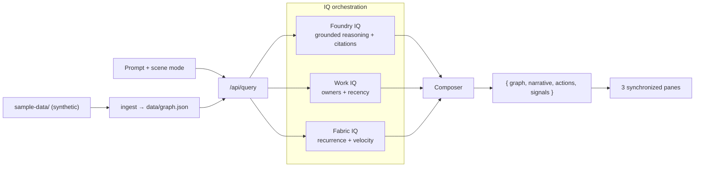

# ✶ Constellation

> **Turn scattered expertise into a living map you can ask questions.**

Constellation turns a specialist's scattered knowledge — reports, tasks, meeting notes,
decisions — into a living, queryable star-map. Ask one question and it composes three
synchronized views:

1. **Relationship constellation** — a force-directed graph of customers, topics, risks, and
   recommendations that reveals hidden connections across the portfolio.
2. **Narrative timeline** — a grounded, source-cited story of what matters and why.
3. **Action composer** — proposed next steps with an owner, due date, confidence label, and a
   link back to the source artifact.

Built for the **Agents League Hackathon — Creative Apps** track. Every claim carries a source
badge and a confidence label, and a safe-demo mode protects sensitive fields.

---

## The problem

The hard part of expert work isn't *producing* knowledge — it's **connecting and recalling it at
the right moment.** A specialist serving many customers generates deep insight every day, but it
scatters across dozens of files with no relationships, no memory, and no narration. So patterns
stay invisible, work gets repeated, and follow-ups quietly slip.

Constellation makes that invisible web visible, explorable, and self-narrating.

---

## Microsoft IQ integration (honest live-vs-mock)

All submissions must integrate at least one Microsoft IQ layer. Constellation is designed around
all three. **In this MVP every layer runs as a deterministic mock over synthetic data**, with a
clean, live-ready adapter behind an environment flag. Each response surfaces a **Live / Mock**
badge so nothing is overstated.

| Layer | Role in Constellation | MVP status | Flip to live |
|---|---|---|---|
| **Foundry IQ** | Multi-hop reasoning over the graph; infers links shared across customers and composes grounded, cited narratives. | **Mock (deterministic), live-ready** | `FOUNDRY_LIVE=true` + Azure AI Foundry project |
| **Work IQ** | Enriches actions with owner, recency, and "discussed but unassigned" meeting context. | Mock (sample data) | `WORKIQ_LIVE=true` + Microsoft Graph |
| **Fabric IQ** | Recurrence and velocity analytics — how often a pattern repeats, how many actions are open. | Mock (sample data) | `FABRICIQ_LIVE=true` + OneLake / Fabric SQL |

> **Honesty rule:** the reasoning is genuinely computed from the data — it is not a canned script.
> But it runs locally without calling Azure, so the demo never blocks. The Live/Mock badges and
> this table state exactly what is real.

---

## How it works



A lightweight ingest parser reads the synthetic Markdown artifacts and builds a deterministic
knowledge graph. The composer runs the prompt through Foundry IQ (reasoning), enriches with Work
IQ and Fabric IQ, and returns a graph emphasis, a cited narrative, and grounded actions.

---

## Signature creative modes

| Mode | What it surfaces |
|---|---|
| **Pattern Hunt** | Hidden clusters — risks and topics shared across customers. |
| **Executive Story** | A board-ready narrative of the period: resilience, modernization, cost, and the follow-through gap. |
| **Playbook Remix** | A fix proven at one customer, remixed onto another with the same open risk. |

Each mode visibly changes the graph emphasis and the narrative framing for the same data.

---

## Repository layout

```text
constellation/
├─ sample-data/          # synthetic, 100% fictional source artifacts (the ingest input)
├─ data/graph.json       # generated knowledge graph (committed so the demo runs immediately)
├─ scripts/ingest.ts     # batch ingest → data/graph.json
├─ api/                  # Express + TypeScript API
│  └─ src/
│     ├─ graph/build.ts      # Markdown → knowledge graph (parser)
│     ├─ graph/patterns.ts   # cross-customer pattern detection
│     ├─ iq/foundry.ts       # Foundry IQ — grounded reasoning (core)
│     ├─ iq/workiq.ts        # Work IQ adapter (+ mock)
│     ├─ iq/fabriciq.ts      # Fabric IQ adapter (+ mock)
│     ├─ compose/compose.ts  # orchestration
│     ├─ safety/redact.ts    # safe-demo redaction
│     └─ server.ts           # validation, rate limit, routes
└─ web/                  # Vite + React + TypeScript client
   └─ src/
      ├─ components/Constellation.tsx  # force-directed graph
      ├─ components/StoryPane.tsx      # narrative + source badges
      ├─ components/ActionComposer.tsx # action cards
      └─ App.tsx                       # three synchronized panes
```

---

## Getting started

**Prerequisites:** Node.js 20+ (22 LTS recommended).

```bash
# 1. Install all workspaces
npm install

# 2. (Optional) regenerate the knowledge graph from the synthetic data
npm run ingest

# 3. Run the API (:3001) and web app (:5173) together
npm run dev
```

Then open <http://localhost:5173> and ask a question.

No `.env` is required — every IQ layer defaults to its deterministic mock. Copy `.env.example` to
`.env` only when you want to wire a live IQ layer.

---

## Demo prompts

Try these (or click the example chips in the UI):

1. *"Which customers likely share backup-restore risk patterns?"* → Pattern Hunt finds the
   restore-hydration risk shared by **Northwind, Contoso, and Fabrikam**.
2. *"Build a 5-slide narrative from this week's cross-customer signals."* → Executive Story.
3. *"Show repeated recommendations not yet converted into tracked actions."* → surfaces
   *attach-before-hydration* and *validate the immutable lock period* — both proven, both untracked.

---

## Safety & trust

- **Source-grounded:** every narrative segment and action links back to a file in `sample-data/`.
- **Confidence labels:** Verified / Likely / Uncertain on every claim.
- **Safe-demo mode:** masks owner names to initials and **blocks export** (`/api/export` returns
  `403`) to prevent leaking sensitive content. External publishing is off by default.
- **Hardened API:** input validation (Zod), a 64 KB body cap, and rate limiting (60 req/min);
  `helmet` and a strict CORS origin.
- **No `dangerouslySetInnerHTML`:** generated text is rendered as text.

---

## Data: synthetic only

Everything under `sample-data/` is **100% fictional** — invented companies (Northwind, Contoso,
Fabrikam, Tailwind, Proseware) and invented people. It mirrors the *shape* of a real
multi-customer workspace without any real names or content.

> ⚠️ **Hackathon disclaimer:** this is a public repository. It contains **no confidential
> information**. Do not add real customer data.

---

## Going live (optional)

Each IQ layer has a real-API seam behind an env flag. Until a live path is implemented, Foundry
**fails closed** if `FOUNDRY_LIVE=true` without a configured endpoint (it never silently falls
back to mock). Prefer `DefaultAzureCredential` over secrets.

```bash
FOUNDRY_LIVE=true
AZURE_AI_FOUNDRY_ENDPOINT=https://<your-foundry-endpoint>
AZURE_AI_FOUNDRY_PROJECT=<project>
```

---

## Verification checklist

- `npm install` resolves cleanly.
- `npm run ingest` regenerates `data/graph.json` and prints the detected cross-customer patterns.
- `npm run dev` brings up both servers; a prompt returns a graph, narrative, actions, and signals.
- Each scene mode visibly changes the emphasis and narrative.
- Safe-demo masks owners and refuses export; the API rejects empty/oversized prompts.

---

_Built with GitHub Copilot for the Agents League Hackathon. Synthetic data only._
